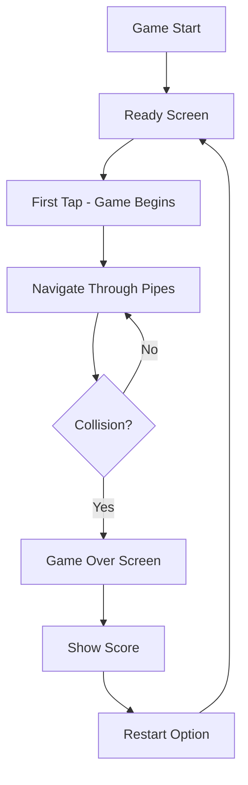

## 1. Product Overview
A beautiful, responsive Flappy Bird clone game built with modern web technologies. Players navigate a bird through obstacles by tapping to maintain flight while avoiding collision with pipes.
- Provides engaging casual gaming experience for users of all ages
- Offers cross-platform gameplay on desktop and mobile devices

## 2. Core Features

### 2.1 User Roles
This game does not require user authentication - it's a casual single-player game accessible to all visitors.

### 2.2 Feature Module
Our Flappy Bird clone consists of the following main pages:
1. **Game Page**: Main gameplay area with bird, pipes, score display, and game controls
2. **Game Over Page**: Score summary, best score display, and restart options

### 2.3 Page Details

| Page Name | Module Name | Feature description |
|-----------|-------------|---------------------|
| Game Page | Game Canvas | Render bird character, moving pipes, and background. Display real-time score counter in top-center |
| Game Page | Bird Physics | Implement gravity and jump mechanics. Bird falls naturally and jumps upward on tap/click/spacebar |
| Game Page | Pipe Generation | Create pipes with random heights at regular intervals. Pipes move left continuously |
| Game Page | Collision Detection | Detect collisions between bird and pipes, ground, or screen boundaries |
| Game Page | Score System | Award 1 point each time bird successfully passes through pipe gap |
| Game Over Page | Score Display | Show current score, best score, and comparison with previous attempts |
| Game Over Page | Restart Button | Allow instant game restart with single click/tap |

## 3. Core Process
The main user flow begins when a player accesses the game. The bird starts in a ready position with instructions to tap/click to begin. Once the player makes their first input, the bird begins falling due to gravity and the player must tap rhythmically to keep it airborne while navigating through gaps between pipes. Each successful pipe passage awards one point. If the bird hits any obstacle, the game ends and displays the final score with options to restart.

## 4. User Interface Design

### 4.1 Design Style
- **Primary Colors**: Sky blue (#87CEEB) background, green pipes (#228B22), yellow bird (#FFD700)
- **Secondary Colors**: White clouds, brown ground, orange accents for UI elements
- **Button Style**: Rounded corners with subtle shadows, responsive hover effects
- **Font**: Clean, bold sans-serif for scores and UI text
- **Layout Style**: Full-screen game canvas with minimal UI overlay
- **Icons**: Simple, cartoon-style graphics matching the original Flappy Bird aesthetic

### 4.2 Page Design Overview

| Page Name | Module Name | UI Elements |
|-----------|-------------|-------------|
| Game Page | Game Canvas | Full-screen canvas with parallax scrolling background, animated bird sprite, green pipes with gradient shading, ground texture |
| Game Page | Score Display | Large white numbers centered at top, subtle shadow for readability, increases with animation effect |
| Game Page | Ready Overlay | Semi-transparent overlay with "Tap to Start" text, fades out on first input |
| Game Over Page | Modal Overlay | Semi-transparent dark overlay with centered white card containing score information |
| Game Over Page | Score Card | Current score in large font, best score comparison, restart button with hover animation |

### 4.3 Responsiveness
Desktop-first design approach with full mobile optimization. Game automatically scales to fit any screen size while maintaining aspect ratio. Touch controls optimized for mobile devices with larger tap targets. Responsive breakpoints ensure smooth gameplay on tablets and phones in both portrait and landscape orientations.