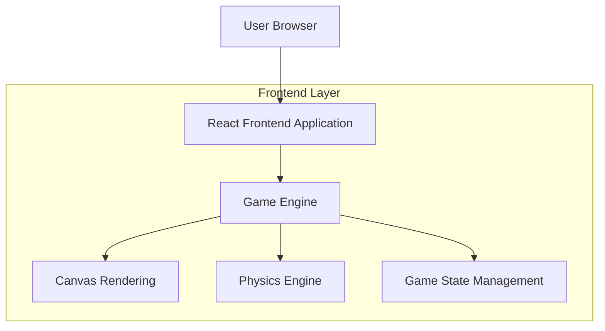

## 1. Architecture design

## 2. Technology Description
- Frontend: React@18 + tailwindcss@3 + vite
- Initialization Tool: vite-init
- Backend: None
- Additional Libraries: HTML5 Canvas API for game rendering

## 3. Route definitions

| Route | Purpose |
|-------|---------|
| / | Main game page - displays the complete Flappy Bird game |

## 4. API definitions
This is a client-side only game with no backend API requirements.

## 5. Server architecture diagram
No server architecture required - this is a purely client-side application.

## 6. Data model
No database or persistent data storage required. Game state is managed in React state and localStorage for high scores.